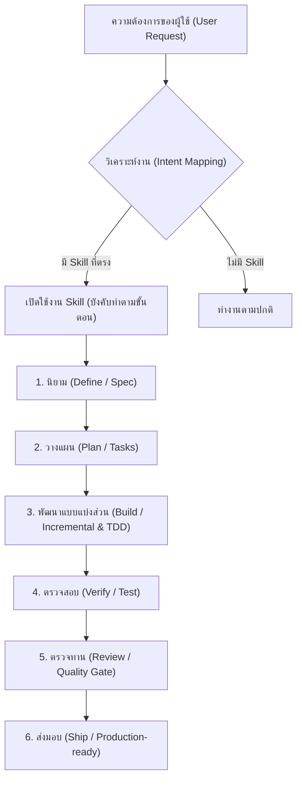

# คู่มือการใช้งานระบบ Agent Skills (ภาษาไทย)

คู่มือนี้จัดทำขึ้นเพื่อให้คุณเข้าใจโครงสร้าง แนวคิด วิธีการทำงาน และการใช้งานระบบ **Agent Skills** ในโปรเจกต์นี้อย่างละเอียด

> [!NOTE]
> โปรเจกต์นี้มีคลังสำหรับการรันและปรับแต่ง AI agent skills โดยอ้างอิงหลักมาจาก [Nack-GitHub/agent-skills](https://github.com/Nack-GitHub/agent-skills.git) และมีการดึง/รวม (pull/integrate) ทรัพยากรและเวิร์กโฟลว์เฉพาะของ C#/.NET จากคลังข้อมูลอย่างเป็นทางการของไมโครซอฟท์ที่ [dotnet/skills](https://github.com/dotnet/skills.git) เข้ามาใช้งานร่วมด้วย


---

## 1. ภาพรวมและเหตุผลเบื้องหลัง (Why & For What Reason)

### ทำไมต้องมี Agent Skills?
โดยทั่วไป AI Coding Agents มักจะเขียนโค้ดทันทีเมื่อได้รับโจทย์ (Jump straight to coding) ซึ่งมักนำไปสู่:
*   การละเลยขอบเขตข้อกำหนด (Scope Creep)
*   ขาดการวางแผนที่ดี ทำให้โค้ดซับซ้อนเกินจำเป็น
*   ขาดการเขียนเทสต์ที่ครอบคลุม (No Test-Driven Development)
*   เกิด Bug หรือ Regression ในภายหลัง

**Agent Skills** ถูกสร้างขึ้นเพื่อแก้ไขปัญหานี้ โดยการ**ถอดรหัสกระบวนการทำงานและคุณภาพของวิศวกรซอฟต์แวร์ระดับ Senior Staff** ให้กลายเป็นเวิร์กโฟลว์ที่ AI Agent ต้องปฏิบัติตามอย่างเคร่งครัด



---

## 2. โครงสร้างของโปรเจกต์ (Project Structure)

โปรเจกต์นี้ประกอบด้วย 3 เลเยอร์หลักที่มีหน้าที่แตกต่างกันอย่างชัดเจน:

| เลเยอร์ (Layer) | โฟลเดอร์ในระบบ | นิยาม | หน้าที่ทางสถาปัตยกรรม | ตัวอย่าง |
| :--- | :--- | :--- | :--- | :--- |
| **Skills** | `skills/` | **The "How"** (ทำอย่างไร) | เวิร์กโฟลว์, ขั้นตอน และเกณฑ์การผ่านของแต่ละประเภทงาน | `spec-driven-development`<br>`test-driven-development` |
| **Agents** | `agents/` | **The "Who"** (ใครเป็นคนทำ) | บทบาท/มุมมอง (Persona) เฉพาะทางพร้อมรูปแบบผลลัพธ์ | `code-reviewer`<br>`security-auditor` |
| **Commands** | `.claude/commands/` | **The "When"** (ทำตอนไหน) | จุดเชื่อมต่อสำหรับเรียกใช้งาน (Slash Commands) | `/spec`, `/plan`, `/build`, `/ship` |

### คำอธิบายโครงสร้างโฟลเดอร์สำคัญ:
*   `skills/` – ประกอบด้วยโฟลเดอร์ย่อยของแต่ละ Skill ภายใต้แต่ละโฟลเดอร์จะมีไฟล์หลักคือ `SKILL.md` (ระบุ YAML Frontmatter สำหรับจับคู่ Intent และขั้นตอนปฏิบัติ) และอาจมีโฟลเดอร์ย่อย เช่น `scripts/` (สคริปต์เสริม), `examples/` (ตัวอย่างการใช้งาน)
*   `agents/` – ประกอบด้วยไฟล์ Markdown ของแต่ละบทบาท เช่น `code-reviewer.md`, `security-auditor.md` ซึ่งทำหน้าที่เป็น System Prompt ให้กับ AI Subagent
*   `references/` – เอกสารอ้างอิงเชิงทฤษฎีและรูปแบบการทำงาน (Orchestration Patterns)
*   `AGENTS.md` – ไฟล์ตั้งค่ากฎและแผนผังพฤติกรรมหลักสำหรับ AI Agent ที่เข้ามาทำงานในโปรเจกต์นี้

---

## 3. การทำงานของ Skills (The How)

### ทำไม/เพราะอะไรจึงต้องใช้?
เพื่อบล็อกไม่ให้ Agent เลือกใช้วิธีลัด (Shortcuts) และบังคับใช้แนวทางปฏิบัติที่ดีที่สุด (Best Practices) เช่น การเขียนรายละเอียดคุณสมบัติ (Spec) ก่อนลงมือเขียนโค้ดจริง หรือการทดสอบแบบ TDD (Red-Green-Refactor)

### ใช้เมื่อไหร่? (Intent → Skill Mapping)
เมื่อพบเจตนา (Intent) ที่สอดคล้องกับงานเหล่านี้ ระบบจะดึง Skill ออกมาใช้งานโดยอัตโนมัติ:

*   **สร้างฟีเจอร์ใหม่:** ใช้ `spec-driven-development` ➡️ `incremental-implementation` ➡️ `test-driven-development`
*   **วางแผน/ย่อยงานใหญ่:** ใช้ `planning-and-task-breakdown`
*   **แก้ไขบั๊ก/ระบบทำงานผิดปกติ:** ใช้ `debugging-and-error-recovery`
*   **รีวิวโค้ด/ประกันคุณภาพ:** ใช้ `code-review-and-quality`
*   **ปรับโครงสร้างโค้ดให้ง่ายขึ้น:** ใช้ `code-simplification`
*   **ออกแบบ API หรือ Interface:** ใช้ `api-and-interface-design`
*   **พัฒนาหรือปรับปรุงหน้าจอ UI:** ใช้ `frontend-ui-engineering`

### ใช้อย่างไร?
1.  **การระบุขั้นตอนใน `SKILL.md`**: แต่ละ Skill จะมีกระบวนการ (Process) ที่ระบุขั้นตอนชัดเจน รวมถึงความเชื่อที่ผิดพลาดที่ต้องระวัง (Anti-Rationalizations) และสัญญาณเตือน (Red Flags)
2.  **การทำงานร่วมกับ AI Tools**:
    *   เมื่อคุยกับ AI Agent (เช่น Claude Code, Antigravity) และระบุความต้องการ AI จะสแกนค้นหา Skill ที่ตรงกัน
    *   เมื่อเจอข้อความจับคู่ AI จะเรียกใช้เครื่องมือ `view_file` เพื่อเปิดอ่าน `SKILL.md` เสมอ
    *   AI จะปฏิบัติตามกฎในเอกสารนั้น เช่น สร้างแผนงาน หรือเขียนการทดสอบ (Unit Tests) ก่อนเขียน Logic เสมอ

> [!IMPORTANT]
> **Anti-Rationalization (ความคิดที่ผิดที่ต้องห้าม):**
> *   *"งานนี้เล็กเกินกว่าจะใช้ Skill"* ❌ (ใช้เสมอไม่ว่าจะงานเล็กหรือใหญ่เพื่อคุณภาพที่สม่ำเสมอ)
> *   *"เดี๋ยวเขียนโค้ดเสร็จแล้วค่อยทำเทสต์ทีหลัง"* ❌ (ต้องปฏิบัติตาม TDD อย่างเคร่งครัด)

---

## 4. การทำงานของ Agents / Personas (The Who)

### ทำไม/เพราะอะไรจึงต้องใช้?
การใช้ Agent ทั่วไป (Generalist Agent) บ่อยครั้งจะทำให้ได้รับคำแนะนำที่กว้างเกินไป การแยก Agent ออกเป็น **Specialist Personas** ช่วยให้ AI โฟกัสไปที่**มุมมอง (Perspective) เดียว** ทำให้ได้คำตอบและรายงานที่เจาะลึก แม่นยำ และใช้จำนวน Token น้อยลงเนื่องจากขอบเขตงานที่แคบลง

### บุคลากรในระบบ (Personas)
ในโปรเจกต์นี้มี Personas หลัก 4 บทบาท:

1.  **[code-reviewer](file:///Users/nack/MyProjects/agent-skills/agents/code-reviewer.md) (Senior Staff Engineer)**
    *   *เน้น:* ตรวจสอบคุณภาพโค้ด ความเข้าใจง่าย โครงสร้างสถาปัตยกรรม และการจัดขนาด Commit ที่ดี
2.  **[security-auditor](file:///Users/nack/MyProjects/agent-skills/agents/security-auditor.md) (Security Engineer)**
    *   *เน้น:* วิเคราะห์ช่องโหว่ความปลอดภัย ตรวจหาข้อมูลสำคัญที่อาจรั่วไหล (Secrets) และตรวจสอบความปลอดภัยตามแนวทาง OWASP
3.  **[test-engineer](file:///Users/nack/MyProjects/agent-skills/agents/test-engineer.md) (QA Engineer)**
    *   *เน้น:* ออกแบบกลยุทธ์การทดสอบ ตรวจสอบความครอบคลุม (Coverage) และบังคับใช้ Prove-It Pattern
4.  **[web-performance-auditor](file:///Users/nack/MyProjects/agent-skills/agents/web-performance-auditor.md) (Web Performance Engineer)**
    *   *เน้น:* ตรวจสอบประสิทธิภาพของเว็บแอปพลิเคชัน วิเคราะห์ Core Web Vitals (LCP, INP, CLS) และทรัพยากรเครือข่าย

### ใช้เมื่อไหร่ และใช้อย่างไร?

#### A. เรียกใช้งานโดยตรง (Direct Invocation)
ใช้เมื่อคุณต้องการความคิดเห็นเฉพาะด้านจากผู้เชี่ยวชาญคนใดคนหนึ่ง เช่น:
*   *"ช่วยรีวิวโค้ดใน PR นี้หน่อย"* ➡️ เรียกใช้ `code-reviewer`
*   *"ระบบล็อกอินของเรามีช่องโหว่ความปลอดภัยไหม"* ➡️ เรียกใช้ `security-auditor`

#### B. เรียกผ่าน Slash Command / การทำงานแบบขนาน (Parallel Fan-out)
นี่เป็นรูปแบบหลักของระบบเมื่อคุณต้องการส่งมอบงานเข้าสู่การผลิต (Production) เช่น การใช้คำสั่ง `/ship` ซึ่งระบบจะทำงานแบบขนาน (Parallel Execution):

```
                       ┌───────┐
                       │ /ship │
                       └───────┘
                           │
         ┌─────────────────┼─────────────────┐
         ▼                 ▼                 ▼
 ┌───────────────┐ ┌───────────────┐ ┌───────────────┐
 │ code-reviewer │ │security-auditor│ │ test-engineer │
 └───────────────┘ └───────────────┘ └───────────────┘
         │                 │                 │
         └─────────────────┼─────────────────┘
                           ▼
                 ┌──────────────────┐
                 │    Merge Phase   │ (รวบรวมรายงานและตัดสินใจ)
                 └──────────────────┘
```

> [!WARNING]
> **กฎเหล็กของการประสานงาน (Orchestration Rules):**
> *   **Personas จะต้องไม่เรียกใช้ Persona อื่นซะเอง** (เช่น `code-reviewer` ห้ามสั่งเปิด `security-auditor`) เพื่อควบคุมขนาดของ Context Window และป้องกันลูปการทำงานวนซ้ำ
> *   ผู้ใช้หรือคำสั่งระบบ (Slash Commands) เท่านั้นที่เป็นผู้สั่งเริ่มทำงาน

---

## 5. แผนผังวงจรการพัฒนาซอฟต์แวร์ (SDLC Lifecycle)

เพื่อให้เข้าใจได้ง่าย เวิร์กโฟลว์ทั้งหมดจะผูกเข้ากับวงจรการพัฒนาซอฟต์แวร์ 6 ขั้นตอน ดังนี้:

```
  1. DEFINE          2. PLAN          3. BUILD          4. VERIFY         5. REVIEW         6. SHIP
 ┌────────┐       ┌────────┐       ┌────────┐        ┌────────┐        ┌────────┐       ┌────────┐
 │  Idea  │ ───▶  │  Spec  │ ───▶  │  Code  │ ───▶   │  Test  │ ───▶   │   QA   │ ───▶  │   Go   │
 │ Refine │       │  PRD   │       │  Impl  │        │ Debug  │        │  Gate  │       │  Live  │
 └────────┘       └────────┘       └────────┘        └────────┘        └────────┘       └────────┘
   /spec            /plan            /build            /test             /review          /ship
```

1.  **DEFINE (`/spec`)**: กำหนดข้อกำหนดที่ชัดเจนก่อนเริ่มงาน
2.  **PLAN (`/plan`)**: แบ่งงานใหญ่ให้เป็นงานชิ้นเล็กๆ ที่ตรวจสอบได้
3.  **BUILD (`/build`)**: ลงมือพัฒนาทีละส่วนแบบเพิ่มขยาย (Incremental) ควบคู่กับ TDD
    *   💡 *คำแนะนำเพิ่มเติม:* สามารถใช้คำสั่ง **`/build auto`** เพื่อให้ระบบดำเนินตามแผนงานและแก้ปัญหาโดยอัตโนมัติ โดยระงับการแทรกแซงจากมนุษย์เว้นแต่กรณีทดสอบไม่ผ่านหรือพบจุดผิดพลาดวิกฤต
4.  **VERIFY (`/test`)**: ตรวจสอบผลลัพธ์ผ่านตัวทดสอบและจำลองสภาพแวดล้อมจริง
5.  **REVIEW (`/review`)**: ประเมินความสะอาดและความเรียบร้อยของโค้ดก่อนทำการผสาน
6.  **SHIP (`/ship`)**: ทำการส่งมอบฟีเจอร์หรือโปรเจกต์ด้วยความปลอดภัยสูง

---

## 6. สรุปแนวทางสำหรับวิศวกรซอฟต์แวร์ในการนำไปใช้งาน

หากต้องการประยุกต์ใช้งานในโปรเจกต์อื่นๆ:
1.  **นำคู่มือนี้หรือแนวคิดไปใช้:** สามารถนำโฟลเดอร์ `skills/` ไปคัดลอกลงในโปรเจกต์ของคุณ ภายใต้โฟลเดอร์ควบคุมของเอดิเตอร์ (เช่น `.cursor/skills/` หรือเรียกใช้ผ่าน `npx skills add Nack-GitHub/agent-skills`)
2.  **ปฏิบัติตามลำดับขั้นตอน:** เมื่อใช้งานร่วมกับ AI อย่ากดเร่งให้จบงานในทันที ให้เริ่มจากการถาม Spec เสมอแล้วค่อยขยับไปสร้าง Plan โค้ดที่เขียนจะออกมาเป็นระเบียบและไม่มีบั๊กรบกวน
